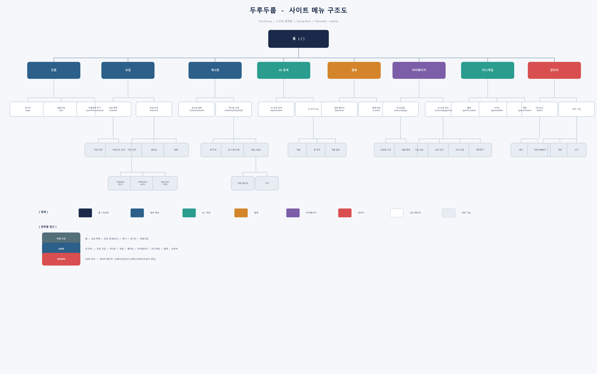
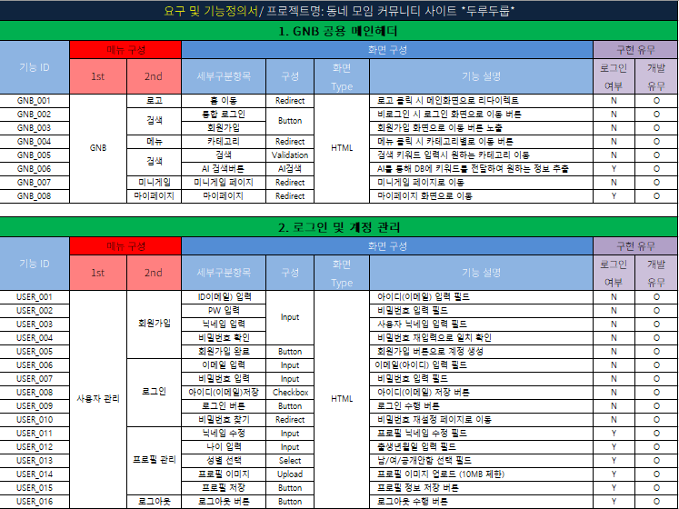
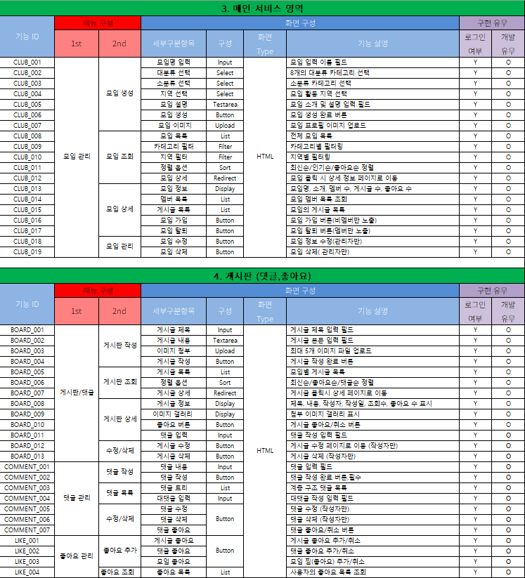
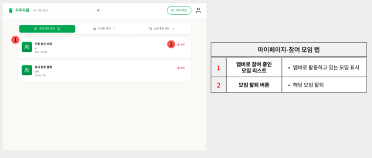
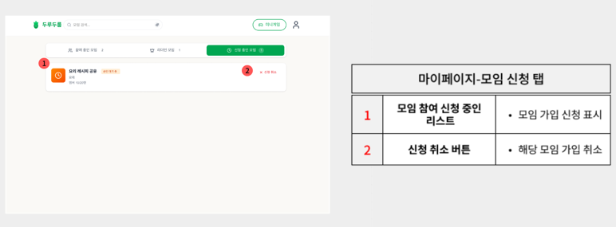
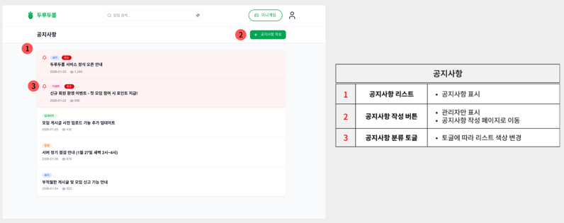
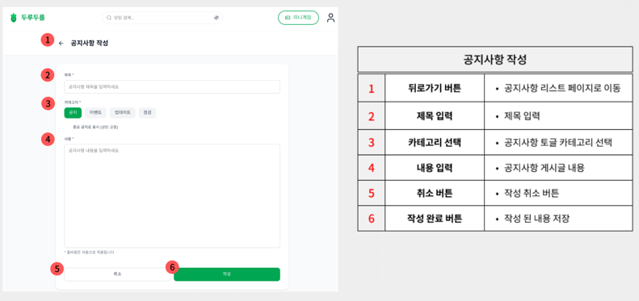
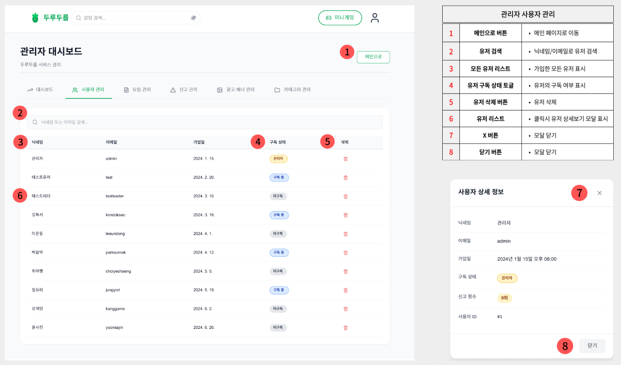

# **프로젝트 : 두루두룹 (DuruDurub) - React 리팩토링** 👥

<p align="center">
  
</p>

> 관심사가 같은 사람들과 모여 새로운 경험을 만들어가는 **소셜 모임 플랫폼**
> 
> 기존 Thymeleaf 기반 프로젝트를 **React + Spring Boot REST API** 로 프론트/백 분리 리팩토링

<br>

## 📌 시연 영상

[](https://www.youtube.com/watch?v=yVU2fAoMcvc)

> ⬆️ 이미지를 클릭하면 시연 영상으로 이동합니다.

<br>

---

## 📋 목차
- [1. 프로젝트 개요](#1-프로젝트-개요)
- [2. 프로젝트 구조](#2-프로젝트-구조)
- [3. 팀 구성 및 역할](#3-팀-구성-및-역할)
- [4. 기술 스택](#4-기술-스택)
- [5. 프로젝트 수행 경과](#5-프로젝트-수행-경과)
- [6. 핵심 기능 코드 리뷰](#6-핵심-기능-코드-리뷰)
- [7. 화면 UI](#7-화면-ui)
- [8. 자체 평가 의견](#8-자체-평가-의견)

---

<br>

## 1. 프로젝트 개요

### 1-1. 프로젝트 주제
- 관심사 기반 소셜 모임 플랫폼 **"두루두룹"** — React 리팩토링 버전

### 1-2. 주제 선정 배경
- 코로나 이후 오프라인 만남에 대한 수요 증가
- 기존 소셜 플랫폼의 한계점 (카테고리 세분화 부족 등)

### 1-3. 기획 의도
- 누구나 쉽게 관심사 기반 모임을 만들고 참여할 수 있는 플랫폼
- AI 검색을 통한 맞춤형 모임 추천

### 1-4. 리팩토링 목적
- 기존 Thymeleaf 서버 사이드 렌더링 → **React SPA + REST API** 분리
- 세션 기반 인증 → **JWT 토큰 기반 인증** + **OAuth 2.0 소셜 로그인** (카카오/네이버/구글) 전환
- Figma 디자인 기반 **최신 UI/UX** 적용 (Tailwind CSS, Radix UI, shadcn/ui)

### 1-5. 기대효과
- 프론트/백 독립 개발로 생산성 향상
- JWT 기반 Stateless 인증으로 확장성 확보
- React 컴포넌트 재사용으로 유지보수성 향상

<br>

---

## 2. 프로젝트 구조

### 2-1. 주요 기능
| 구분 | 기능 |
|:---:|:---|
| 👤 사용자 | 회원가입 / 로그인 (JWT 토큰 인증) / 소셜 로그인 (카카오, 네이버, 구글) |
| 🔍 모임 탐색 | 카테고리별 모임 목록 / 모임 상세 조회 |
| 🤖 AI 검색 | OpenAI API 기반 맞춤형 모임 검색 |
| ❤️ 즐겨찾기 | 관심 모임 좋아요 / 즐겨찾기 목록 관리 |
| 📝 게시판 | 모임 내 게시글 / 댓글 작성 및 좋아요 |
| 🗺️ 지도 | Leaflet.js 기반 모임 위치 표시 |
| 💳 결제 | Toss Payments 연동 프리미엄 구독 |
| 🎮 미니게임 | 랜덤 미니게임 |
| 🔔 공지사항 | 공지 등록 / 조회 / 수정 / 삭제 |
| 🛡️ 관리자 | 회원 관리 / 모임 관리 / 배너 관리 / 신고 관리 |

### 2-2. 메뉴 구조도
<details>
  <summary>메뉴 구조도 펼치기</summary>
  
  
</details>

<br>

---

## 3. 팀 구성 및 역할

| 이름 | 역할 | 담당 업무 |
|:---:|:---:|:---|
| **안영아** | 팀장 | • 프로젝트 총괄 및 일정 관리<br>• 사용자 및 관리자 페이지 REST API 연동<br>• OAuth 2.0 소셜 로그인 기능 구현 (카카오/네이버/구글)<br>• 프로젝트 깃허브 관리 |<br>•Thymeleaf → React 프론트/백 분리 기초 작업<br>
| **김현수** | 팀원 | • 로그인/회원가입 페이지 구현 및 JWT 인증 방식 전환<br>• 권한 부여 및 데이터 검증<br>• 각종 정의서 작성 및 검증<br>• 유저 데이터 권한 부여 및 패스 구현 |
| **박희진** | 팀원 | • Figma AI Make 화면 설계 및 UI 구성<br>• 카테고리 필터·리스트 구현<br>• 결제 모듈 탑재 및 구현 (토스페이먼츠 API 활용) |
| **최영우** | 팀원 | • 게시판 / AI 검색 기능 REST API 구현<br>• DB 설계 및 수정<br>• 발표, 문서화 및 코드 리팩토링 |

> 💡 인원 : **4명 (팀 리팩토링)** &nbsp;|&nbsp; 기간 : **2026.02 ~ 2026.03**

<br>

---

## 4. 기술 스택

### Frontend
<div align="left">
  
  
  
  
  
  
  
</div>

### Backend
<div align="left">
  
  
  
  
  
  
</div>

### Database
<div align="left">
  
</div>

### API / Service
<div align="left">
  
  
  
  
  
  
</div>

### Tools
<div align="left">
  
  
  
  
  
</div>

### Architecture
```
durudurub/                          ← Spring Boot 백엔드 (REST API)
├── src/main/java/.../
│   ├── config/                     ← Security, Web, CORS 설정
│   ├── controller/                 ← REST API 컨트롤러
│   ├── dao/                        ← MyBatis Mapper 인터페이스
│   ├── dto/                        ← 데이터 전송 객체
│   ├── security/                   ← JWT 인증 필터 & 토큰 유틸
│   └── service/                    ← 비즈니스 로직
├── src/main/resources/
│   ├── mybatis/mapper/             ← SQL 매퍼 XML
│   └── application.properties      ← JWT 시크릿, DB 설정
└── uploads/                        ← 업로드 파일 저장소

durudurub-app/                      ← React 프론트엔드 (Vite + TypeScript)
├── src/
│   ├── api/                        ← Axios API 호출 모듈
│   ├── components/                 ← 공통 UI 컴포넌트 (Navbar 등)
│   ├── contexts/                   ← AppContext (JWT 인증 상태 관리)
│   ├── pages/                      ← 페이지별 컴포넌트
│   ├── layouts/                    ← 레이아웃 컴포넌트
│   ├── routes.tsx                  ← React Router 라우팅 설정
│   └── App.tsx                     ← 앱 진입점
├── package.json                    ← 의존성 관리
└── vite.config.ts                  ← Vite 빌드 설정
```

### 기존 프로젝트 대비 변경점
| 구분 | 기존 (TeamProject1) | 리팩토링 (mini2) |
|:---:|:---:|:---:|
| 프론트엔드 | Thymeleaf (SSR) | React + Vite (SPA) |
| 스타일링 | 순수 CSS | Tailwind CSS + Radix UI |
| 인증 방식 | Spring Security 세션 | JWT 토큰 + OAuth 2.0 소셜 로그인 |
| 통신 방식 | 폼 서밋 + 일부 fetch | Axios REST API |
| 지도 | Kakao Maps API | Leaflet.js |
| 프로젝트 구조 | 모놀리식 | 프론트/백 분리 |

<br>

---

## 5. 프로젝트 수행 경과

### 5-1. 요구사항 & 기능 정의서
<details>
  <summary>요구사항 및 기능 정의서 펼치기</summary>
  
  
  
  
  
</details>

### 5-2. ERD
<details>
  <summary>ERD 펼치기</summary>
  
  
</details>

<br>

---

## 6. 핵심 기능 코드 리뷰

### 6-1. JWT 인증 & OAuth 2.0 소셜 로그인
> Spring Security + JWT 토큰 기반 Stateless 인증 + 카카오/네이버/구글 소셜 로그인

<details>
  <summary>코드 보기</summary>

```java
// JwtAuthenticationFilter.java — 모든 요청마다 JWT 토큰을 검증하는 필터
@Component
@RequiredArgsConstructor
public class JwtAuthenticationFilter extends OncePerRequestFilter {

    private final JwtProvider jwtProvider;

    @Override
    protected void doFilterInternal(HttpServletRequest request,
                                    HttpServletResponse response,
                                    FilterChain filterChain) throws ServletException, IOException {

        // 1. Authorization 헤더에서 Bearer 토큰 추출
        String authorization = request.getHeader("Authorization");

        if (authorization != null && authorization.startsWith("Bearer ")) {
            String token = authorization.substring(7);

            // 2. 토큰 유효성 검증
            if (jwtProvider.validateToken(token)) {
                String userId = jwtProvider.getUserId(token);
                String role = jwtProvider.getRole(token);

                if (role == null || role.isBlank()) {
                    role = "ROLE_USER";
                } else if (!role.startsWith("ROLE_")) {
                    role = "ROLE_" + role;
                }

                // 3. SecurityContext에 인증 객체 등록 → 이후 컨트롤러에서 인증 정보 사용 가능
                UsernamePasswordAuthenticationToken authentication =
                        new UsernamePasswordAuthenticationToken(
                                userId, null,
                                Collections.singletonList(new SimpleGrantedAuthority(role))
                        );
                SecurityContextHolder.getContext().setAuthentication(authentication);
            }
        }
        filterChain.doFilter(request, response);
    }
}
```
</details>

### 6-2. React Context 기반 인증 상태 관리
> AppContext + useApp() 훅을 활용한 전역 인증 상태 관리

<details>
  <summary>코드 보기</summary>

```tsx
// AppContext.tsx — JWT 토큰 & 유저 정보를 전역으로 관리하는 React Context

interface User {
  id: string; email: string; name: string;
  isAdmin?: boolean; isPremium?: boolean;
}

export function AppProvider({ children }: { children: ReactNode }) {
  const [user, setUser] = useState<User | null>(null);
  const [accessToken, setAccessToken] = useState<string | null>(null);

  // 새로고침 시 sessionStorage에서 로그인 상태 복원
  useEffect(() => {
    const storedToken = sessionStorage.getItem('accessToken');
    const storedUser = sessionStorage.getItem('user');
    if (storedToken && storedUser) {
      const tokenParts = storedToken.split('.');
      if (tokenParts.length === 3) {          // JWT 형식 검증 (header.payload.signature)
        setAccessToken(storedToken);
        setUser(JSON.parse(storedUser));
      } else {
        sessionStorage.removeItem('accessToken');
        sessionStorage.removeItem('user');
      }
    }
  }, []);

  // 로그인: 상태 + sessionStorage 동기화
  const handleLogin = (userData: User, token: string) => {
    setUser(userData);
    setAccessToken(token);
    sessionStorage.setItem('user', JSON.stringify(userData));
    sessionStorage.setItem('accessToken', token);
  };

  // 로그아웃: 상태 + sessionStorage 초기화
  const handleLogout = () => {
    sessionStorage.removeItem('accessToken');
    sessionStorage.removeItem('user');
    setUser(null);
    setAccessToken(null);
  };

  return (
    <AppContext.Provider value={{ user, accessToken, handleLogin, handleLogout, ... }}>
      {children}
    </AppContext.Provider>
  );
}

// 커스텀 훅 — 어디서든 useApp()으로 인증 상태 접근
export function useApp() {
  const context = useContext(AppContext);
  if (!context) throw new Error('useApp must be used within an AppProvider');
  return context;
}
```
</details>

### 6-3. AI 검색 기능 (OpenAI API)
> 사용자의 자연어 검색어를 OpenAI API로 분석하여 맞춤형 모임을 추천합니다.

<details>
  <summary>코드 보기</summary>

```java
// AiSearchController.java — 검색 횟수 제한 + OpenAI 키워드 추출 + DB 매칭
@PostMapping("/search")
public ResponseEntity<?> search(@RequestBody Map<String, String> request) {
    // 1. 로그인·구독·관리자 여부에 따라 무료 검색 횟수(3회) 체크
    User user = userService.selectByUserId(auth.getName());
    if (!isAdmin && !isSubscriber) {
        int totalCount = aiSearchLogMapper.countByUserNo(user.getNo());
        if (totalCount >= FREE_LIMIT)
            return ResponseEntity.status(HttpStatus.FORBIDDEN)
                    .body(Map.of("error", "무료 검색 횟수를 모두 사용하셨습니다."));
    }

    // 2. OpenAI API로 사용자 메시지에서 키워드 + 동의어/유사어 추출
    //    예: "서울에서 등산 같이 할 사람?" → "등산, 산, 하이킹, 트레킹, 서울"
    String keywordsRaw = extractKeywords(userMessage);
    String[] keywords = keywordsRaw.split("[,\\s]+");

    // 3. 추출된 키워드 각각으로 DB 검색 (중복 제거)
    for (String kw : keywords) {
        List<Club> result = clubMapper.search(kw.trim());
        // ... 중복 제거 후 clubs에 추가
    }

    // 4. 검색 결과가 없으면 전체 모임을 AI에게 전달하여 추천
    if (clubs.isEmpty()) {
        allClubs = clubMapper.list();
    }

    // 5. AI 추천 메시지 생성 + 검색 로그 저장 (횟수 차감)
    String aiMessage = generateRecommendation(userMessage, clubs, allClubs);
    aiSearchLogMapper.insert(searchLog);

    return ResponseEntity.ok(AiSearchResponse.builder()
            .aiMessage(aiMessage).clubs(clubs).keyword(displayKeyword).build());
}
```
</details>

### 6-4. Toss Payments 결제 연동
> 프리미엄 구독을 위한 결제 시스템

<details>
  <summary>코드 보기</summary>

```java
// PaymentController.java — Toss Payments 결제 승인 + 구독 활성화
@PostMapping("/confirm/payment")
public ResponseEntity<Map<String, Object>> confirmPayment(@RequestBody Map<String, Object> payload) {
    String paymentKey = String.valueOf(payload.get("paymentKey"));
    String orderId   = String.valueOf(payload.get("orderId"));
    int    amount    = Integer.parseInt(String.valueOf(payload.get("amount")));

    // 1. 주문 조회 및 금액 위변조 검증
    Payment payment = paymentService.selectByOrderId(orderId);
    if (payment == null) return notFound("ORDER_NOT_FOUND");
    if (payment.getAmount() != amount) return badRequest("AMOUNT_MISMATCH");

    // 2. 이미 승인된 결제인 경우 → 구독 상태만 확인 후 반환
    if ("DONE".equalsIgnoreCase(payment.getStatus())) {
        // 구독이 비활성이면 활성화 처리
        if (!isSubscriptionActive) {
            int periodMonths = resolvePeriodByAmount(amount);
            subscriptionService.activateSubscription(payment.getUserNo(), periodMonths);
        }
        return ResponseEntity.ok(response);
    }

    // 3. Toss Payments API에 결제 승인 요청
    Map<String, Object> tossResponse = paymentService.confirmTossPayment(paymentKey, orderId, amount);

    // 4. DB에 승인 상태 반영
    paymentService.markApproved(orderId, paymentKey);

    // 5. 금액에 따른 구독 기간 계산 후 구독 활성화
    int periodMonths = resolvePeriodByAmount(amount);   // 3900→1개월, 9900→3개월, 18000→6개월
    subscriptionService.activateSubscription(payment.getUserNo(), periodMonths);

    return ResponseEntity.ok(response);
}
```
</details>

<br>

---

## 7. 화면 UI

### 메인 화면
<details>
  <summary>메인 화면 보기</summary>
  
  
</details>
<br>

### 모임 탐색 (Explore)
<details>
  <summary>모임 탐색 화면 보기</summary>
  
  
</details>
<br>

### 모임 상세
<details>
  <summary>모임 상세 화면 보기</summary>
  
  <br>
  
</details>
<br>

### AI 검색
<details>
  <summary>AI 검색 화면 보기</summary>
  
  
</details>
<br>

### 로그인 / 회원가입
<details>
  <summary>로그인 / 회원가입 화면 보기</summary>
  
  <br>
  <br>
  
</details>
<br>

### 마이페이지
<details>
  <summary>마이페이지 화면 보기</summary>
  
  <br>
  <br>
  <br>
  <br>
  
</details>
<br>

### 결제 (구독)
<details>
  <summary>결제 화면 보기</summary>
  
  
</details>
<br>

### 공지사항 페이지
<details>
  <summary>공지사항 페이지 화면 보기</summary>
  
  <br>
  <br>
  
</details>

### 관리자 페이지
<details>
  <summary>관리자 페이지 화면 보기</summary>
  
  <br>
  <br>
  <br>
  
</details>
<br>

<br>

---

## 8. 자체 평가 의견

### 8-1. 개별 평가

**안영아**
> - MVC 구조에 대한 전반적인 시스템을 이번 프로젝트에 적용하여 흐름에 대한 이해도를 높였으며, REST API와 AJAX를 중점으로 비동기 UI 처리 구조를 구현하여 자연스러운 화면 전환이 되는 서비스를 제공할 수 있었습니다.
> - 복잡해진 JS로 인해 다소 어려움이 있어서 체계적인 코드 설계에 대한 보완점을 알게 되었습니다.

**김현수**
> - Spring Boot 기반으로 회원가입, 로그인 기능과 권한 부여 구조를 직접 구현했으며, Security 설정 과정에서 시행착오를 겪었지만 계층 구조를 명확히 분리하며 좀 더 안정적으로 구조를 설계할 수 있었습니다.
> - 이를 통해 보안 흐름과 사용자 처리 로직에 대한 이해·공부를 더 하게 되었으며, 문제 해결 능력과 백엔드 설계 역량을 한 단계 더 끌어올릴 수 있었습니다.

**박희진**
> - 결제 시스템을 처음 구현하며 결제 방식부터 요청, 응답 프로세스까지의 전체적인 흐름을 알게 되었습니다.
> - 구현 과정에서 복잡한 결제 로직 처리에 대해 기술적으로 어려움이 있었지만, 이를 해결하며 서버와 클라이언트 간 데이터 흐름과 보안 처리의 중요성을 체감할 수 있었습니다.

**최영우**
> - 게시판, AI 검색 등 주요 기능을 REST API로 전환하며 프론트/백 분리 통신 구조를 이해했습니다.
> - DB 스키마 수정과 API 설계를 병행하며 백엔드 전반의 흐름을 경험했습니다.

### 8-2. 종합 평가

**잘된 점**
- 기존 Thymeleaf 모놀리식 프로젝트를 React SPA + Spring Boot REST API로 성공적으로 분리하여 프론트/백 독립 개발 구조 확립
- JWT 기반 Stateless 인증 체계를 도입하고, OAuth 2.0 소셜 로그인(카카오/네이버/구글)까지 연동하여 다양한 인증 방식 지원
- Figma AI Make를 활용한 UI 설계 후 Tailwind CSS + Radix UI(shadcn/ui)로 구현하여 현대적이고 일관된 디자인 시스템 구축
- 각 팀원이 원본 프로젝트에서 맡았던 기능을 직접 REST API로 전환하며, 실질적인 유지·보수 및 리팩토링 경험 축적
- OpenAI API를 활용한 AI 검색, Toss Payments 결제 연동, Leaflet.js 지도 등 다양한 외부 API 통합 경험 확보
- MVC 패턴과 REST API 설계를 병행하며 백엔드 아키텍처에 대한 팀 전체의 이해도 향상

**한계점**
- 시간 부족으로 AI 검색에 MCP 기반 agentic 구조를 적용하지 못해, 단순 OpenAI API 호출 수준에 머무름
- 결제 모듈이 Toss Payments 테스트 키로만 동작하여 실제 결제·환불·구독 갱신 프로세스 미완성
- 프론트엔드 JS/TS 코드가 복잡해지면서 체계적 모듈화가 부족하여 유지보수 난이도 상승
- Spring Security 설정 과정에서 CSRF·CORS 등 보안 정책 최적화가 미흡
- 단위·통합 테스트 코드 부재로 기능 변경 시 사이드이펙트 검증이 어려움

**개선점**
- AI 검색 기능에 MCP를 활용한 agentic 구조 고도화로 더 정확한 모임 추천 제공
- 실제 결제 API 키 적용 및 결제 프로세스(환불·구독 갱신 등) 완성
- 프론트엔드 JavaScript/TypeScript 코드의 체계적 모듈화 및 공통 컴포넌트 분리
- Spring Security 설정 고도화 및 CSRF, CORS 등 보안 정책 정교화
- 테스트 코드 작성 및 CI/CD 파이프라인 구축으로 배포 자동화

---

<br>
